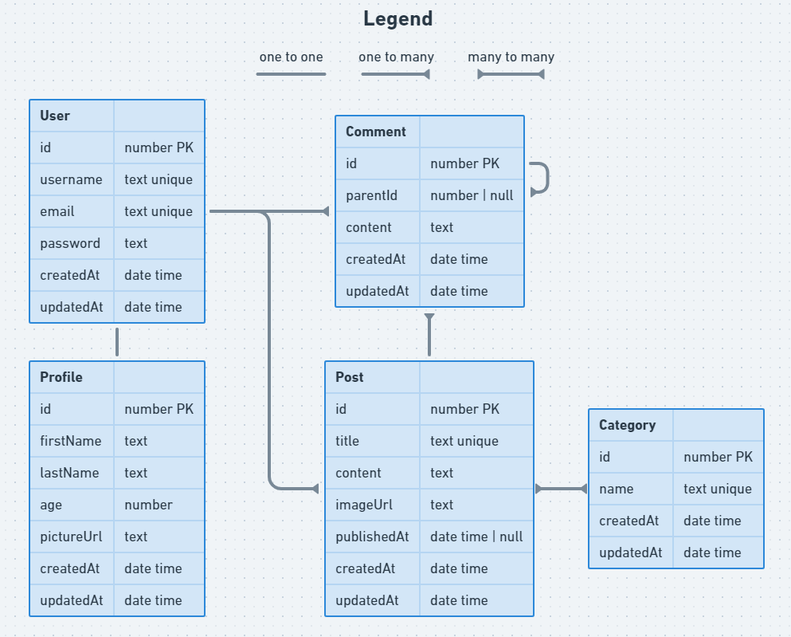

# Blog Challenge

## Learning Objectives

- Use an ORM to implement a database design
- Use an ORM to create seed data in a database
- Design and build a RESTful API

## Introduction

This is an opportunity to test your ability in building a backend project. There is no boilerplate code, no package.json, no src directory; it's down to you to build this project from scratch, with a little guidance.

## Instructions

1. Fork this repository and clone the fork to your machine.
2. Work through each requirement in the `requirements` directory in numerical order.
3. Commit and push regularly.

## Complete ERD

*Note that some foreign keys are missing from the diagram - this is intentional, you should add the relevant relations in the schema file.*

